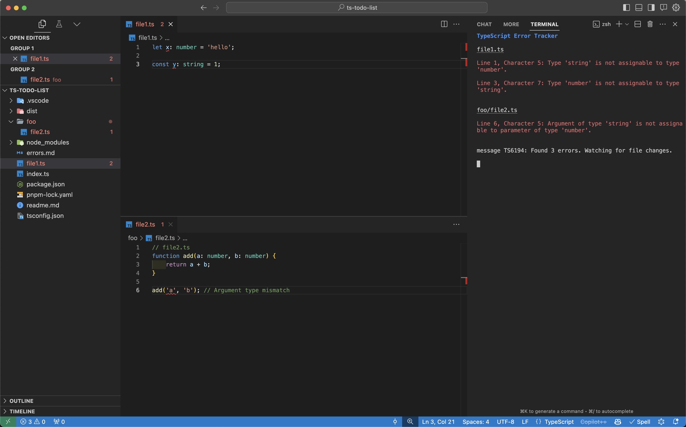
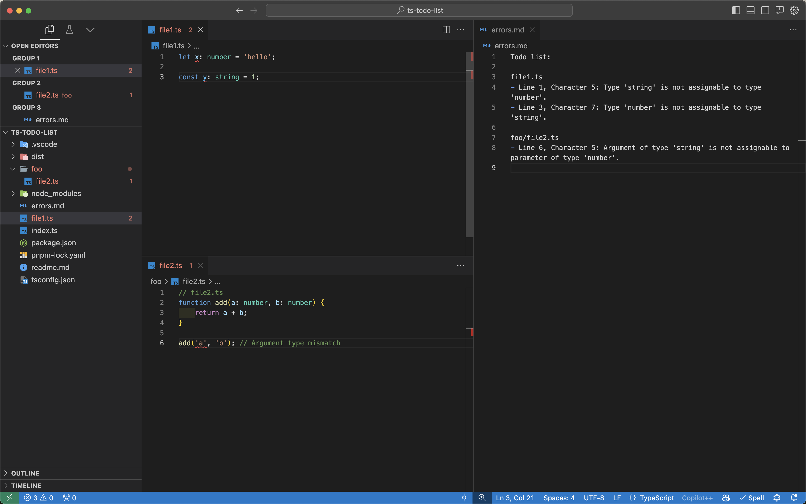
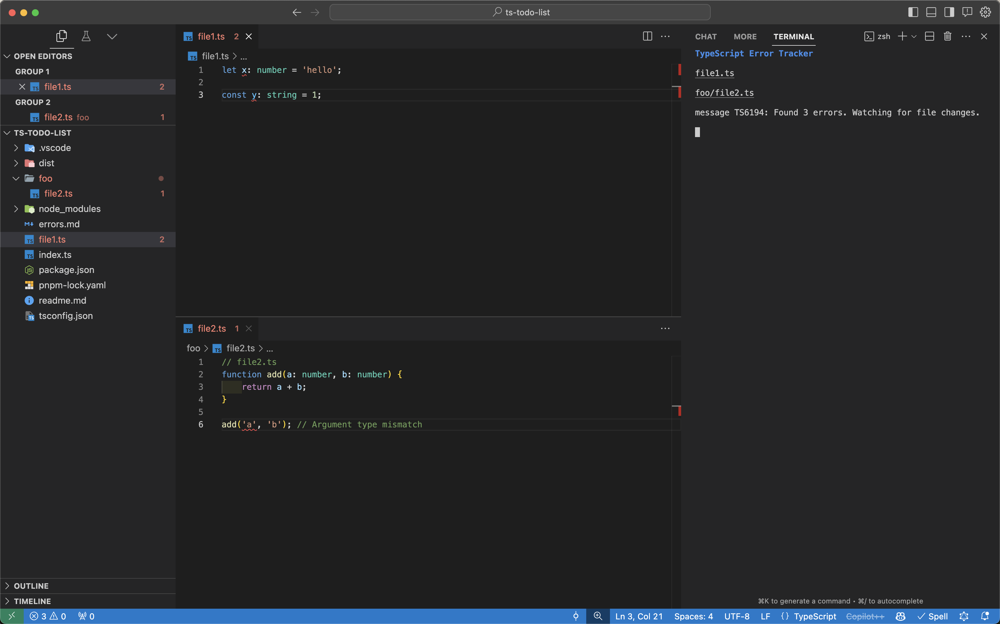

# ❑ TypeScript Todos ✓

## Description

TypeScript Todos is a CLI tool that consolidates TypeScript's error reporting during development. It monitors your TypeScript project in real-time via incremental compilation, checking for any compile-time errors and provides a clear, formatted display of diagnostic information directly in the terminal or markdown file. It can also output errors to a Markdown file for documentation or review purposes.

## Installation
```zsh
npm install ts-todos
```

## Usage
```zsh
ts-todos
```

## Command-line Flags
The tool accepts the following command-line flags:

- `--output-markdown` or `-m`: Outputs the error list to a markdown file named errors.md in your project directory. (default: `false`)
- `--no-cli-output` or `-c`: Disables real-time error display in the CLI. (default: `false`)
- `--hide-error-messages` or `-h`: Hides error messages in the CLI output for concise todo lists. (default: `false`)
- `--output-file` or `-o`: Specify the name of the output markdown file (default: `ts-todos.md`)

## Examples
### Real-time error display in the CLI
```zsh
ts-todos
```



### Markdown list into project root directory
```zsh
ts-todos --output-markdown
```



### CLI output without error messages (condensed)
```zsh
ts-todos --hide-error-messages
```

